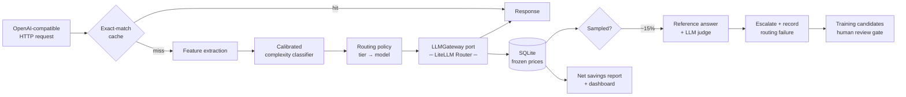

# LLM Cost Autopilot

A routing layer that reads each incoming LLM request, decides how much model it
actually deserves, sends it to the cheapest model that can handle it — and then
keeps checking whether that decision was right.

> **LiteLLM answers *"which deployment of the model I chose?"*.
> This project answers *"which model does this request actually deserve?"*.**

That sentence is the whole scope boundary. LiteLLM is the provider plumbing: one
async call signature across OpenAI, Anthropic and Ollama, a maintained price
map, normalised token usage, retries and fallbacks. What it does **not** do —
and this is confirmed against its routing documentation — is pick a model based
on the *content* of the request. Every one of its strategies (`simple-shuffle`,
`latency-based-routing`, `usage-based-routing-v2`, `least-busy`,
`cost-based-routing`) reasons about deployment metrics: latency, load, spend.
None of them read the prompt.

Reading the prompt, pricing the decision, and proving it was correct is what
this project builds.

---

## How it works



A request arrives on an OpenAI-compatible endpoint, so an unmodified `openai`
Python client can point at it. An exact-match cache short-circuits identical
repeats. Otherwise the prompt becomes a deterministic feature vector, a
calibrated classifier assigns a complexity tier, and a hot-reloadable policy
maps that tier to a model and emits an explainable decision. The call executes
through the `LLMGateway` port. The response returns immediately.

Then the interesting part: a **sampled** subset of requests is re-answered by a
stronger model and scored by a judge. Where the gap is material, the request is
escalated and the routing failure is recorded — and those failures become
candidate training examples, behind a human review gate.

### What "complexity" means here

"Send it to the cheapest model that can handle it" is only a claim if
*complexity* is defined tightly enough that two people labelling the same
prompts agree. That definition is
[`docs/complexity-taxonomy.md`](docs/complexity-taxonomy.md): three tiers, six
escalation signals, an explicit list of things that must **not** escalate a
tier, and a ruling on each of the seven edge cases annotators actually argue
about — several of them justified by a measured failure in the committed
baseline run.

Agreement is measured, reported, and **not** gated: gating on Cohen's κ is an
unbounded relabelling loop that also corrupts the number being optimised
against. Section 9 of that document records what was measured, by whom, and —
just as importantly — what has not been measured yet. The rubric-ambiguity κ
comes from two independent LLM annotators applying the document cold; the
human blind self-relabel is described there as exactly that, and is marked
*not yet run* until it is —
[`docs/human-calibration-guide.md`](docs/human-calibration-guide.md) is how it
gets run.

## The five invariants

Everything in this repository is subordinate to these. They are not aspirations;
several are enforced by types or by CI.

1. **Verification is sampled, never total.** Verifying every request costs a
   reference completion plus a judge call on top of the original — strictly more
   than never routing at all. The config refuses a sample rate above 0.5.
2. **The savings number is net.** Baseline minus routed *minus* verification,
   judge, escalation and fallback overspend. A headline that hides its own
   overhead is the first thing a sharp reviewer pulls on.
3. **Prices are frozen per request.** `CostBreakdown` carries the unit prices
   that produced it, so a row written in March can still be audited in June
   after the provider changed its rate card.
4. **Uncertainty escalates upward.** Low classifier confidence routes to a
   *stronger* model. The system fails toward quality and pays for it knowingly.
5. **The parity estimate matches the sampling design.** Quality parity is
   computed from the random stratum only. The targeted strata are deliberately
   enriched with requests we already suspect; pooling them biases the headline
   number downward and invalidates its confidence interval. `SamplingStratum`
   exists as a required field so this is hard to get wrong by accident.

## Getting started

```bash
git clone https://github.com/0xBroom/llmCostAutopilot.git
cd llmCostAutopilot
make install
cp .env.example .env
make check
```

`make check` runs lint, architecture contracts, type checking and the full test
suite. It needs **no API keys and no network** — see below.

Everything else is a `make` target:

```
make help        list all targets
make format      apply ruff fixes and formatting
make test        the default suite (no network, no spend)
make test-live   opt-in, hits real providers, costs money
```

## Architecture

Ports and adapters, with the dependency rule enforced mechanically rather than
by convention:

```
src/autopilot/
├── domain/           pure types and rules. no I/O, no vendor SDKs
├── application/      use cases + the port Protocols
├── infrastructure/   adapters. the only layer that may import a vendor SDK
├── interfaces/       HTTP, worker, CLI
└── config/           typed settings and YAML loaders
```

`import-linter` fails the build if `domain` or `application` import `litellm`,
`fastapi`, `sklearn`, `sqlite3` or `streamlit`. That contract is what makes the
claim "swap the provider layer without touching business logic" verifiable
instead of aspirational — and it is the cheapest way to keep it true as the
codebase grows.

One contract is worth calling out because it looks odd: **only
`infrastructure/litellm_env.py` may import `litellm`**. LiteLLM reads
`LITELLM_LOCAL_MODEL_COST_MAP` once, at first import, to decide whether to pin
its price map to the packaged copy or fetch a newer one over the network. Set it
too late and it does nothing, silently, and cost figures stop being
reproducible. Funnelling the import through one module puts the environment
variable structurally above it, and a test asserts the source order.

Decisions with reasoning are in [`docs/adr/`](docs/adr/).

## Testing

The rule: **the default suite never spends money and never touches the network.**
A green CI run on a pull request from a fork — where no secrets exist — is the
proof that the rule holds.

| Tier | What it proves | Network |
| :-- | :-- | :-- |
| **Unit** | Routing, escalation, cost arithmetic, sampling. Every port replaced by a typed fake. | none |
| **Contract** | The adapter parses what a provider really sends. Recorded cassettes, replayed. | none |
| **Integration** | Our own services end to end: API → decision → row → queued job. | none |
| **Live** | Reality. Marked `live`, deselected by default. | yes, and it costs money |

The fakes in `tests/fakes/` are **hand-written classes, not mocks**. A
`MagicMock` accepts any call signature, so the day a port grows a parameter, the
mock keeps every test green while production breaks. `tests/unit/test_ports_contract.py`
assigns each fake to its `Protocol` so mypy catches exactly that drift.

Coverage is gated at **75% on `domain/` and `application/` only**. There is no
global gate on purpose: a repo-wide percentage is trivially satisfied by testing
adapters that contract tests should be covering, which makes the number go up
while confidence goes down.

There are also no performance assertions in CI. The latency budgets in this
system are real and are measured — locally, and printed to the benchmark report.
Shared runners vary too much to gate on, and a flaky gate teaches everyone to
ignore CI, which is worse than having no gate at all.

## Status

Under construction. Work is tracked in
[the issues](https://github.com/0xBroom/llmCostAutopilot/issues); the epic is
[#1](https://github.com/0xBroom/llmCostAutopilot/issues/1) and is the source of
truth for scope and sequencing.

## License

MIT.
